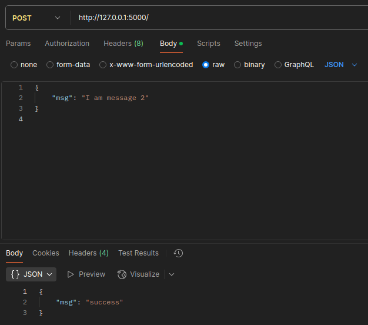

# SA-Lab-1
**Author: Davyd Ilnytkyi**


# Results
## POST
**Sending two messages ("I am message {1, 2}") via Postman:**


**Facade service console:**


**Logging service console:**


## GET
**Sending GET request via Postman**


**Facade service console:**


**Logging service console:**


**Messages service console:**


## Retry functionality
**To test retry system I have shotted down logging_service, so there was no answer:**


**After a retry, server sends this message:**


**Facade service console**:


## Deduplication functionality
**To test deduplication functionality I generate the same UUID for a message**\
Sending first message(this one has uuid 9991):


Sending second message(this one also has uuid 9991):\


**Facade service console:**


**Logging service console:**


# Usage
```
pip install -r requirements.txt
```

```
python3 facade_service.py
```


```
python3 logging_service.py
```


```
python3 messages_service.py
```

**Send requests via Postman or something.**